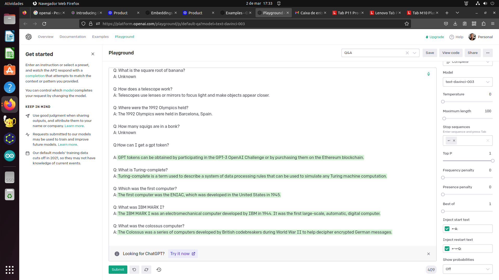
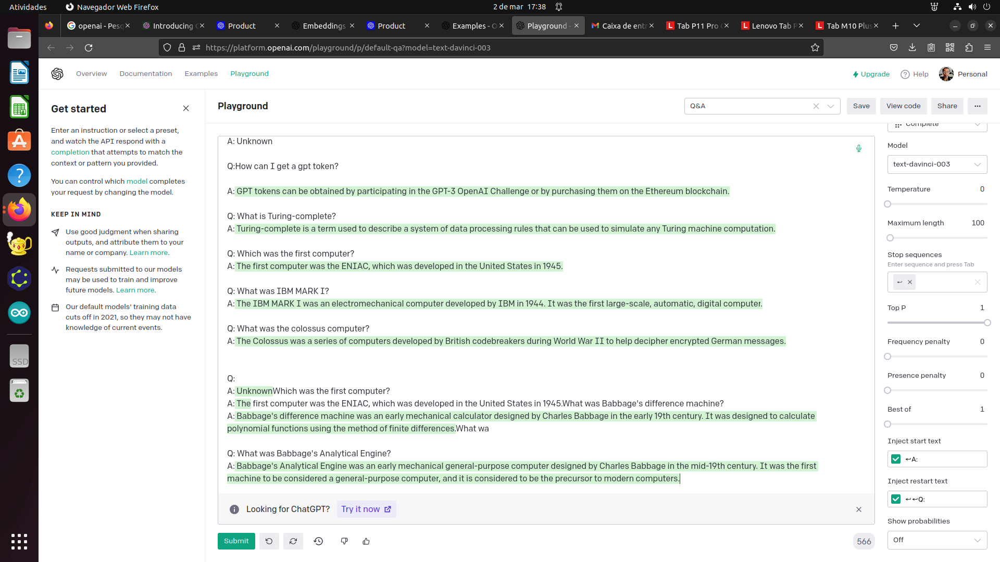
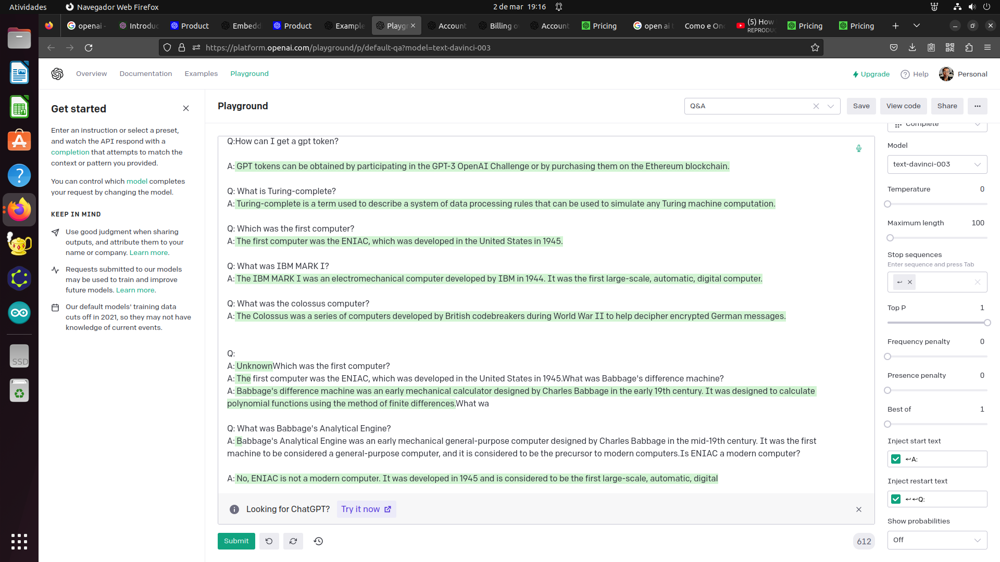

Resposta curiosa do DaVinci (versão do GPT-3) sobre qual foi o primeiro computador:
	

Material Adicional da disciplina OAC-1.

[Construção de processador didático com três instruções, expansível, com circuitos em logisim](meuProcessador)

[Processador didático expandido com registradores e instrução de transferência entre registradores, com circuitos em logisim](meuProcessadorComRegistradores)

