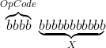
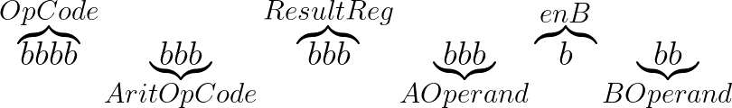

# Explicando a construção de uma unidade de processamento (em simulador), passo a passo, a partir de memórias, registradores, MUX, decodificadores e outros componentes com esse nível de complexidade ou mais simples.

## Motivação


1. Faz a conexão entre conceitos como operações lógicas, circuitos combinacionais e sequenciais, ULA, UC, registradores, máquina de estados, processador, memória, conjunto de instruções, arquitetura do conjunto de instruções, OpCodes, programa;
2. Apresentar um processador pronto, mesmo que simples, e explicá-lo costuma ser muito extenso e complicado; 
3. Desconheço trabalho semelhante.

## Resultados

### Considerações iniciais

#### É diferente do IAS, do ARM, de qualquer outro

- Porque não visa maximizar o uso dos blocos funcionais, nem minimizar a quantidade de componentes;
- visa maximizar a compreensão do circuito;

#### Escolha do comprimento da palavra de memória e da palavra de endereço.

A conexão de muitas vias, mesmo que simplificada no simulador, implica em uma certa carga cognitiva.

Mostrar os sinais auxilia muito a compreensão do funcionamento, mas barramentos muito largos são dificeis de ler;

O IAS usa palavra de memória de 40 bits dividido em 2 instruções. Cada instrução tem 8 bits de OpCode, 12 de endereço.

O simplecpudesign usa palavra de memória de 8 bits com 3 bits de OpCode. O autor menciona que 8 instruções é pouco.

O simplecpudesign usa endereço de 8 bits, o que acho pouco.

Processadores RISC em geral têm da ordem de 30 OpCodes.

Tentei com OpCodes de 4 bits e endereçamento de memória de 10 bits, mas 14 bits é ruim de separar os sinais (que geralmente são divididos em grupos de 1, 4, 8, 16). Então passei para endereçamento de 12 bits.

### Máquina que acessa conteúdo da memória endereçada sequencialmente por um contador

Meta: Acessar as posições de memória sequencialmente. 

Motivo: Este é o funcionamento da busca de instrução quando não há desvio.

[Circuito em logisim](apenasConta.circ)


### Máquina que carrega conteúdo da memória endereçada por um contador em um registrador

Meta: Acessar as posições de memória sequencialmente e carregar o conteúdo armazenado na posição em um registrador. 

Motivo: Este é o funcionamento da busca de instrução quando não há desvio.

[Circuito em logisim](carregaInstrucao.circ)


### Máquina que permite outras operações.

Meta: Criar instantes (bordas de clock) em que algo diferente de carga sequencial de memória possa ser feito.

Motivo: "Abrir espaço no ciclo de funcionamento da máquina" para criar outras instruções.

Acrescenta um contador e um decodificador. Cada saída do decodificador (no máximo uma pode estar em 1, qualquer que seja o instante) pode receber um significado e permitir as operações/sinais associados. Inspirado no simplecpudesign, o primeiro sinal corresponde à busca de instrução, o último ao incremento do contador de programa.

Um ciclo de CPU passa a ter 4 ciclos de clock.

[Circuito em logisim](BuscaIncrementa.circ)


Extra: botão de reset para reiniciar a unidade de processamento (UP). Agora o estado da UP inclui o estado do contador (passo no ciclo do processador).

### Máquina que interpreta os 12 LSB da instrução como endereço e acessa esse endereço se o OpCode for 0b0001

Defini no início que os 4 bits mais significativos em uma instrução vão armazenar o OpCode. A partir deste circuito, eles passam a ter significado distinto. O OpCode 0b0001, os 12 bits do registrador de instrução (RI) são expostos no barramento de endereçamento de memória.

Para selecionar que sinal vai para o barramento - se a saída do contador de programa ou se os 12 bits do RI - uso um MUX de 12 bits de largura e 2 entradas.

[Circuito em logisim](Endereca.circ)

[Conteúdo da memória (carregar na memória para executar)](Endereca.mem)


### Máquina que armazena o conteúdo do endereço dos 12LSB em um registrador (acumulador) se o OpCode for 0b0001.

Esta é a primeira instrução implementada! O OpCode é 0001, mnemônico LDA(X), descrição carrega acumulador com conteúdo da memória endereçado por X. 

Acrescentei o registrador que corresponde ao acumulador. O armazenamento no acumulador ocorre na subida do clock ao FINAL do passo do processador (quando o LED com rótulo "execução da instrução" está apagando).

[Circuito em logisim](Carrega.circ)

[Conteúdo da memória (carregar na memória para executar)](Endereca.mem)


### Máquina que armazena o conteúdo do acumulador no endereço dos 12LSB se o OpCode for 0b0010.

Esta é a segunda instrução implementada! O OpCode é 0010, mnemônico STA(X), descrição armazena o conteúdo do acumulador na posição de endereço X da memória. 

Ajustei o controle do MUX de endereçamento e expus o sinal de gravação de memória. O armazenamento na memória ocorre na subida do clock ao FINAL do passo do processador (quando o LED com rótulo "execução da instrução" está apagando).

[Circuito em logisim](CarregaArmazena.circ)

[Conteúdo da memória (carregar na memória para executar)](CarregaArmazena.mem)


## <a id="2021-05-04-162551" href="#2021-05-04-162551">2021-05-04-162551</a>

Atualmente tem duas instruções implementadas: LDA(X) e STA(X). Acredito que seja suficiente como demonstração de como instruções são implementadas em um processador e como são executadas. A partir daqui, acrescentar uma ULA e os desvios de fluxo devem acrescentar uns MUX e circuitos combinacionais simples. O decodificador de instruções e o ciclo de execução têm "espaço" para tal. Acho que o mais complicado será acrescentar registradores de uso geral, as instruções para usá-los e os sinais para ativá-los.

## <a id="2021-05-06-094429" href="#2021-05-06-094429">2021-05-06-094429</a>

Implementei a instrução de salto incondicional.

Seria "só" fazer a carga paralela do endereço contido na instrução para dentro do contador de programa, ié: conectar os bits do endereço e, se o OpCode for para saltar, fazer load=1, mas... 

...tive problema por causa da lógica de controle do contador, que é diferente do que eu estou acostumado.

| Carga Paralela | Estado atual | Count | Load | Próximo Estado |
| --- | --- | --- | --- | --- |
| X | Q<sub>i</sub> | 0 | 0 | Q<sub>i</sub> |
| P | Q<sub>i</sub> | 0 | 1 | P |
| X | Q<sub>i</sub> | 1 | 0 | Q<sub>i</sub>+1 |
| X | Q<sub>i</sub> | 1 | 1 | Q<sub>i</sub>-1 |

**nota**: P é o sinal presente na entrada paralela. X significa que não é usado. O uso de X instruções é outro. Tenha cuidado!

... o contador decrementa se Count=1 e Load=1. Geralmente o componente tem um sinal up/down para selecionar se incrementa ou decrementa, mas não é o caso aqui.

A combinação count=1, load=1 acontecia (antes de colocar a porta AND, fazendo load= JMP + Execução) quando a instrução era JMP e era para não incrementar o PC (no passo seguinte ao de execução, que, por enquanto, está em branco. Isto fazia o contador de programa decrementar. Da forma como está agora, ele não decrementa, mas passa pelo passo de incremento, o que faz executar a partir do endereço seguinte ao do endereço-alvo, o que é igualmente ruim (circuito no logisim)[CarregaArmazenaSalta.circ]. 

- Uma solução seria reiniciar o contador de passos na etapa 3 quando a instrução for JMP, mas (ainda) não consigo imaginar os efeitos colaterais disso (além de um encurtamento do ciclo do processador).
- Outra seria anular o sinal de incremento do PC se a instrução for JMP.
- Outra seria colocar decodificadores para considerar o OpCode e o passo juntos - o circuito ficaria enorme....
- Outra seria escolher entre carga paralela e incrementar na última fase (acho que esta é a boa).
   - Acho que o que atrapalha meu raciocínio na hora de implementar é mudar dois sinais ao mesmo tempo. No caso, count=~load.
   - Na minha primeira tentativa, [circuito no logisim](CarregaArmazenaSalta2.circ), apenas fiz count=~load, o que fez o pc incrementar em todas as transições de clock (pois não acontece count=0 e load=0, o que faria não incrementar, que é o necessário nos passos diferentes da atualização do PC. Acho que tenho que fazer uma tabela-verdade.
      - fiz uma inversão na ordem das operações que nem sempre é verdade - e isso causou minha confusão: **a inversão**: se for JMP então count=~load, logo, **count=~load e load=JMP** (conclusão errada). Isto fez com que eu não avaliasse os casos em que JMP=0 (apresentação do erro seguido de mostração), onde count deve ser 0 e load deve ser 0, mostrando que count=~load não é sempre verdade (que foi o erro que cometi inicialmente).


| JMP | Atualiza | Estado Atual | Próximo Estado | count | load |
| --- | --- | --- | --- | --- | --- |
| 0 | 0 | Q<sub>i</sub> | Q<sub>i</sub> | ? | ? |
| 0 | 1 | Q<sub>i</sub> | Q<sub>i</sub> +1 | ? | ? |
| 1 | 0 | Q<sub>i</sub> | Q<sub>i</sub> | ? | ? |
| 1 | 1 | Q<sub>i</sub> | P | ? | ? |

**nota**: P é o sinal presente na entrada paralela.

Para realizar a TV acima, load e count precisam ser:


| JMP | Atualiza | Estado Atual | Próximo Estado | count | load |
| --- | --- | --- | --- | --- | --- |
| 0 | 0 | Q<sub>i</sub> | Q<sub>i</sub> | 0 | 0 |
| 0 | 1 | Q<sub>i</sub> | Q<sub>i</sub> +1 | 1 | 0 |
| 1 | 0 | Q<sub>i</sub> | Q<sub>i</sub> | 0 | 0 |
| 1 | 1 | Q<sub>i</sub> | P | 0 | 1 |

Resolvido!!! [circuito no logisim](CarregaArmazenaSalta3.circ)

**nota** ter o conteúdo da memória igual ao endereço da memória gera confusão na simulação pois os números iguais no registrador de instrução, e no barramento de endereçamento induzem ao engano.

[circuito 4 no logisim](CarregaArmazenaSalta4.circ) recoloca algumas conexões para colocar rótulos que correspondem aos mnemonicos junto ao decodificador de instruções. A [imagem de memória](CarregaArmazenaSalta4.mem) contém o programa para demonstrar em aula.

Formato da instrução: Palavra de 16 bits com os quatro primeiros armazenando o OpCode e os doze seguintes armazenando endereço (de operando ou alvo para salto).



<!-- $`\overbrace{bbbb}^{OpCode}\underbrace{bbbbbbbbbbb}_{X}`$ -->

| OpCode  | Mnemônico | Descrição |
| ------  | --------- | --------- |
| (0000)b | NOP       | Não operação |
| (0001)b | LDA(X)    | Carrega conteúdo do acumulador com conteúdo armazenado no endereço X da memória |
| (0002)b | STA(X)    | Armazena no endereço X da memória o conteúdo do acumulador |
| (0003)b | JMP X     | Salta execução para instrução armazenada no endereço X da memória |


## Discussão

Acredito que seja suficiente como exemplo didático, por um balanço entre poder explicativo, tamanho do circuito, tempo disponível para ampliações e existência de implementações mais completas na Internet.

A intenção deste projeto é mostrar os passos iniciais de **um** processo de elaboração, a fim de ter idéia do processo que levou à construção dos processadores apresentados por outros na internet (tanto didáticos quanto comerciais).

Implementar mais funcionalidades e as correspondentes instruções aumentaria o tamanho, aumentaria o tempo necessário para implementar e explicar essas funcionalidades, aproximaria este projeto de poder ser usado de fato (que ousadia!), mas necessita de tempo de que não disponho no curto prazo.

O resultado foi além do proposto pois ilustra as escolhas de projeto ligadas a arquitetura e organização, induz a pensar na escolha de instruções a implementar (*Instruction Set Architecture*).

Apresenta também alguns erros que cometi durante o projeto, como pensei e implementei a correção, à semelhança da implementação e depuração de um programa.

Próximos passos que podem ser interessantes são:

- Acrescentar registradores de uso geral e disponibilizá-los no conjunto de instruções;
- Implementar funções (CALL/RET) - requer registrador para armazenar endereço do topo da pilha;
- Acrescentar unidade lógica e aritmética e disponibilizá-la no conjunto de instruções;
- Implementar instruções de salto condicional;
- Implementar tratamento de interrupções;
- criar um montador (preferencialmente com uma linguagem de montagem compatível com alguma gerada pelo GCC para que o ASM gerado possa ser passado para este montador, aí passa a ser possível reusar os compiladores de GCC);

### Salto condicional

**descontinuado, mantido com a finalidade de registro.** Notei, posteriormente, que o salto condicionais mais útil é o caso em que ACC é diferente de ZERO pois os resultados dos testes sempre(?) ativam bits (nível lógico UM) no PSW. Mascarar os bits corresponde a pelo menos um bit do PSW copiado no resultado. Se esse bit for ZERO, o resultado todo é zero, se esse bit for UM, o resultado todo é diferente de zero.


Salta para o endereço dado junto ao OpCode se o conteúdo do acumulador for 0xFFFF.

Programa exemplo: ./CarregaArmazenaSaltaSeZero2.mem 
	
Circuito: ./CarregaArmazenaSaltaSeFFFF2.circ

### Conservar o endereço do comando em caso de salto

(transformará um jump em um call)


Programa exemplo: ./comSaltoERetorno.mem
	
Circuito: 

### retornar ao endereço seguinte ao salto mais recente

(equivale ao RET)


Programa exemplo: ./comSaltoERetorno.mem

Circuito: ./CarregaArmazenaSaltaSeFFFFRegRet3.circ

### Unidade lógica e aritmética


Circuito: ./LogicaEAritmetica-projeto.circ

### Operações aritméticas

<!--  \overbrace{bbbb}^{OpCode}\underbrace{bbb}_{AritOpCode}\overbrace{bbb}^{ResultReg}\underbrace{bbb}_{First Operand}\overbrace{b}^{enB}\underbrace{bb}_{Second Operand} -->



#### Integrando ao circuito de controle (ainda não testado)


Circuito: ./CarregaArmazenaSaltaArit2.circ

### Interrupções (ainda não operacional em 17.04.2024)

Os sinais de interrupção entrarão no processador pelo registrador PSW. O PSW pode ser copiado para um registrador de uso geral e testado. As interrupções podem ou não ser atendidas, dependendo de como o programa for feito. É diferente das arquiteturas usuais onde atendimento de interrupção corresponde a um dos estados do processador e seu atendimento pode ser desabilitado por máscaras (há um registrador que contém as configurações de que interrupção pode/deve ser atendida).

## Integração ao circuito de controle testada. PSW testado, mudei JF para JNZ. Funcionando de acordo com o esperado.


Circuito: ./CarregaArmazenaSaltaArit3.circ

### Exemplos de operações aritméticas

// carga do acumulador para um registrador - verificado em 2024-04-11, funcionam
ARIT ADD, B, A, zero 0110 110 001 000 0 00 = 6C40
ARIT ADD, C, A, zero 0110 110 010 000 0 00 = 6C80
ARIT ADD, D, A, zero 0110 110 011 000 0 00 = 6CC0
ARIT ADD, PSW, A, zero 0110 110 111 000 0 00 = 6DC0 (o PSW não pode ser escrito diretamente!)
ARIT ADD, *RP, A, zero 0110 110 110 000 0 00 = 6D80

// carga de um registrador para o acumulador - verificado em 2024-04-11, funcionam
ARIT ADD, A, B, zero 0110 110 000 001 0 00 = 6C08
ARIT ADD, A, C, zero 0110 110 000 010 0 00 = 6C10
ARIT ADD, A, D, zero 0110 110 000 011 0 00 = 6C18
ARIT ADD, A, PSW, zero 0110 110 000 111 0 00 = 6C38
ARIT ADD, A, *RP, zero 0110 110 000 110 0 00 = 6C30

O programa de teste é: testaMovRegAccEAccReg.mem
Outro programa de teste: movRegAcc.mem
nota: zero no operando B corresponde a desabilitar o operando B

ARIT ZERO, A, X, X = 0110 000 000 000 0 000 = 6000  // os operandos não são usados, então podem ARIT ZERO, B, X, X = 0110 000 001 000 0 000 = 6040  // os operandos não são usados, então podem ser quaisquer. Neste caso usei os de bits zero para facilitar a codificação.
ARIT F, C, X, X = 0110 001 010 000 0 000 = 6280  // os operandos não são usados, então podem ser quaisquer. Neste caso usei os de bits zero para facilitar a codificação.

ARIT ADD, A, A, B 0110 110 000 000 1 01 = 6C05  // acc=acc+B
ARIT ADD, A, PSW, zero 0110 110 000 111 0 00 = 6C38

até aqui usando o circuito CarregaArmazenaSaltaArit2.circ (deve funcionar igual no CarregaArmazenaSaltaArit3.circ)

a partir daqui usando o circuito CarregaArmazenaSaltaArit3.circ

### Atribuição, operação aritmética e teste de erro

(Permite começar a construir a ligação entre a linguagem da máquina e linguagens de programação mais comuns (como C))

x está no endereço 0x100 e vale 0xbeba = 0b1011111010111010
y está no endereço 0x102 e vale 0xc01a = 0b1100000000011010
z está no endereço 0x050 e recebe o resultado

z=y+x deveria ser                                     0b0111 1110 1101 0100 (overflow) = 0x7ed4
psw=0x8888 = overflow na soma, A<B (ok!)
salta (para tratamento de erro) se overflow

O programa:  1100 6c40 1102 6c05 2050 6c38

bits do psw= overflow na soma | underflow na subtração | A>B | A=B | A<B 0010001000

como os sinais de controle de LDA e STA são diferentes de ARIT (em especial no decodificador de instruções), LDA e STA não alteram o conteúdo do PSW, logo, é possível intercalar operações aritméticas com STA e não perder o conteúdo de PSW. Isto é interessante para conservar o resultado de uma conta e, em seguida, checar o que ocorreu (ex. overflow).

programa completo em initEPSW.mem
circuito: CarregaArmazenaSaltaArit3.circ

**próximas metas**

- Testa se ocorreu overflow
- Salta para tratamento de erro
- Copia de array (alocação dinâmica)
- Chamada recursiva (pilha de execução)

2024-04-14T095853

Salto se não zero parece mais conveniente que salto se zero pois as condições (que acho) mais frequentes para testes são armazenadas em bits no PSW e, se verdadeiras, setam o bit, então PSW será diferente de zero. (ajuste feito em CarregaArmazenaSaltaArit3.circ)

... acrescentando um teste ao programa:

x está no endereço 0x100 e vale 0xbeba = 0b1011111010111010
y está no endereço 0x102 e vale 0xc01a = 0b1100000000011010
z está no endereço 0x050 e recebe o resultado

psw=0x8888 = overflow na soma, A<B (ok!)
salta (para tratamento de erro) se overflow

ARIT ADD, B, PSW, zero 0110 110 001 111 0 00 = 6C78

O programa:  1100 6c40 1102 6c05 2050 6c78

a constante 8000 está armazenada em 0x130

... 1130 

ARIT AND, A, A, B 0110 011 000 000 1 01 = 6605
JNZ 200

... 4200

esr:

a constante 0xcaca está na posição 0x151
a constane 0x0001 está na posição 0x152
a constante 0x2000 está na posição 0x153

1151  6C40 6C80 6CC0 

1160 6c40 1153 6805 2220 (instrução para armazenar o valor do acumulador no endereço apontado por p) 1151 (poe caca no acumulador) 3220 (salta para função que armazena conteúdo do acc em 170) 1160 6C40 1152 6C05 2160 3204

ARIT OR, A, A, B 0110 100 000 000 1 01 = 6805
ARIT ADD, B, A, zero 0110 110 001 000 0 00 = 6C40
ARIT ADD, B, A, B 0110 110 001 000 1 01 = 6C45
ARIT ADD, C, A, zero 0110 110 010 000 0 00 = 6C80
ARIT ADD, D, A, zero 0110 110 011 000 0 00 = 6CC0

ARIT ADD, A, A, B 0110 110 000 000 1 01 = 6C05  // acc=acc+B

a variável p está na posição 0x160 e contém 0x170
os comandos 2160 320b (endereço de volta do esr) estão na posição 0x220

*programa testado*

(overflowEesr-testado.mem)

```
v2.0 raw
0 1100 6c40 1102 6c05 2050 6c78 1130
6605 4200 0 6040 6280 0 0 0
1100 6c40 1102 6c05 2050 6c38 3000 57*0
7ed4 175*0 beba c0ca c01a 501a 4*0 babe
0 c01a 50fa 4*0 beba c0ca 0 5e1a
4*0 babe c01a cac0 5*0 cac0 7*0 c01a
7*0 8000 c10a ca00 30*0 caca 1 2000
12*0 172 15*0 caca caca 142*0 1151 6c40
6c80 6cc0 1160 6c40 1153 6805 2220 1151
3220 1160 6c40 1152 6c05 2160 3204 15*0
2171 320b
```

Mnemônicos

```
NOP
LDA(100)                     // z=y+x
ARIT ADD, B, A, zero         // z=y+x
LDA(102)                     // z=y+x
ARIT ADD, A, A, B            // z=y+x
STA(050)                     // z=y+x
ARIT ADD, B, PSW, zero       // if (overflow) ESR
LDA(130)                     // if (overflow) ESR
ARIT AND, A, A, B            // if (overflow) ESR
JNZ 200  // salta para ESR   // if (overflow) ESR
NOP
ARIT ZERO, B, X, X           // comandos que não serão executados
ARIT F, C, X, X
NOP
NOP
NOP
LDA(100)
ARIT ADD, B, A, zero
LDA(102)
ARIT ADD, A, A, B
STA(050)
ARIT ADD, A, PSW, zero
JMP 0

 beba                        // int y=0xbeba
 c0ca                        
 c01a                        // int x=0xc01a
  501a 4*0 babe
0 c01a 50fa 4*0 beba c0ca 0 5e1a
4*0 babe c01a cac0 5*0 cac0 7*0 c01a
7*0 
8000                         // #define OVERFLOW_MASK 0x8000 
c10a ca00 30*0 caca 
1                            // #define UM 0x0001
2000                         // #define STA_OPCODE 0x2000
12*0 172
200: LDA(151)          // carrega acc com 0xcaca
ARIT ADD, B, A, zero
ARIT ADD, C, A, zero
ARIT ADD, D, A, zero
204: LDA(160)          // prepara instrução 2000 | *p  do... while (1)
ARIT ADD, B, A, zero   // prepara instrução 2000 | *p
LDA(153)               // prepara instrução 2000 | *p
ARIT OR, A, A, B       // prepara instrução 2000 | *p
STA(220)               // prepara instrução 2000 | *p
LDA(151)               // carrega acc com 0xcaca
JMP 220                // salta para 220
20B: LDA(160)          //p=p+1
ARIT ADD, B, A, zero   //p=p+1
LDA(152)               //p=p+1
ARIT ADD, A, A, B      //p=p+1
STA(160)               //p=p+1
JMP 204

220: 0000
JMP 20B
```

O programa inicializa as constantes e aloca três variáveis (x, y, z). Inicializa x com 0xbeba e y com 0xco1a. Calcula a soma e armazena em z. Essa soma causa *overflow*. O PSW é lido e o bit de *overflow* é selecionado com o uso de uma máscara de bits. Caso o resultado seja diferente de zero, salta para a rotina de tratamento de erro (esr). A rotina de tratamento de erro preenche todos os registradores de uso geral com 0xcaca e executa um loop que a partir do endereço armazenado no endereço 0x160, preenche as palavras com 0xcaca. Em algum momento a rotina de tratamento de erro será sobrescrita.


| OpCode  | Mnemônico | Descrição |
| ------  | --------- | --------- |
| (0000)b | NOP       | Não operação |
| (0001)b | LDA(X)    | Carrega conteúdo do acumulador com conteúdo armazenado no endereço X da memória |
| (0010)b | STA(X)    | Armazena no endereço X da memória o conteúdo do acumulador |
| (0011)b | JMP X     | Armazena o próximo endereço sequencial no registrador R e **salta** execução para instrução armazenada no endereço X da memória |
| (0100)b | JNZ X     | Se o acumulador for diferente de zero, armazena o próximo endereço sequencial no registrador R e salta execução para instrução armazenada no endereço X da memória |
| (0101)b | RET       | Armazena o próximo endereço sequencial no registrador R e **salta** execução para endereço armazenado no registrador R |
| (0110)b | ARIT     | Executa operação aritmética a atualiza registrador PSW |

*Documento finalizado*: Este documento não receberá mais atualizações até ser remodelado
