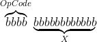
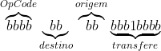
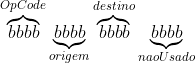

# Explicando a construção de uma unidade de processamento (em simulador), passo a passo, a partir de memórias, registradores, MUX, decodificadores e outros componentes com esse nível de complexidade ou mais simples. Parte II acrescentando registradores.

## Motivação

Além das apresentadas na [versão anterior](../meuProcessador):

1. Processadores comerciais têm registradores de uso geral;
2. É o próximo passo da versão anterior e é estrutura necessária para implementar operações aritméticas, saltos condicionais, ...; 

## Resultados

### Sumário

O processador realiza as seguintes operações:

Formato da instrução: Palavra de 16 bits com os quatro primeiros armazenando o OpCode e os doze seguintes armazenando outros parâmetros:

- em JMP armazena o endereço de memória para onde saltar;
- em LDA e STA, armazena o endereço de memória onde carregar/armazenar o valor;
- em TRA, armazena os índices dos registradores de origem e de destino e tem um bit para informar se deve carregar zero ( útil para inicializar registradores, talvez evolua para implementar operações aritméticas). 

Para JMP, LDA e STA: 
<!-- $`\overbrace{bbbb}^{OpCode}\underbrace{bbbbbbbbbbbb}_{X}`$ -->

Para TRA: 

<!-- $`\overbrace{bbbb}^{OpCode}\underbrace{bb}_{destino}\overbrace{bb}^{origem}\underbrace{bbb1bbbb}_{transfere}`$ -->

| OpCode  | Mnemônico | Descrição |
| ------  | --------- | --------- |
| (0000)b | NOP       | Não operação |
| (0001)b | LDA(X)    | Carrega conteúdo do acumulador com conteúdo armazenado no endereço X da memória |
| (0010)b | STA(X)    | Armazena no endereço X da memória o conteúdo do acumulador |
| (0011)b | JMP X     | Salta execução para instrução armazenada no endereço X da memória |
| (0100)b | TRA D, O  | Transfere conteúdo do registrador O para o registrador D, o acumulador tem índice 0 (zero) |

### Considerações iniciais

É construído a partir da [versão anterior](../meuProcessador). Recomendo ler as considerações colocadas lá também.

Em geral as escolhas de projeto vão para a seção **Discussão** mas vou deixar nesta seção, por comodidade.

#### É diferente do IAS, do ARM, de qualquer outro

- Porque não visa maximizar o uso dos blocos funcionais, nem minimizar a quantidade de componentes;
- visa maximizar a compreensão do circuito;

#### Escolhas

Levei um tempo (de reflexão) até chegar a uma organização com poucos componentes, funcionalidade adequada e de baixo impacto na arquitetura do conjunto de instruções. Explico:

Num primeiro momento tentei desenvolver o projeto centrado na ULA. Isto significa implementar de uma vez só tanto o *banco de registradores* E as instruções de transferência entre registradores, quanto as operações lógicas e aritméticas. Organização e arquitetura era inspirada no caminho de dados mais conhecido. Um par de tentativas de simulação (frustradas) mais tarde, percebi que:

1. em todas as soluções que pensei eu usaria muitos OpCodes (só tenho 16);
2. precisaria implementar uma ULA no logisim; 
3. precisaria lidar com muitos sinais de controle:
   - Seleção dos operandos;
   - Seleção da operação;
5. a transferência entre registradores seria algo como somar zero e armazenar;
   - para transferir de um registrador para o acumulador precisaria zerar o acumulador - gastaria um ciclo a mais;
   - eu não conseguia imaginar o circuito para transferir do acumulador para algum registrador;
4. precisaria incluir no circuito o registrador de status da ULA (o que armazena os flags de *zero*, *overflow*, ... e que é "consultado" para os saltos condicionais.

**nota**: são percepções, eu poderia estar errado, outra pessoa poderia perceber diferente e resolver a questão.

Decidi dividir este desenvolvimento em partes com funcionalidades mais restritas, menos sinais, e, pensando em como economizar OpCodes.

As idéias foram vindo:

1. As instruções de transferência entre registradores não operam sobre a memória, logo, os 12 bits da instrução, que usei para endereçamento poderiam ser usados para outra coisa;
   - algo como  *atenção, no final não ficou assim!*
<!-- $`\overbrace{bbbb}^{OpCode}\underbrace{bbbb}_{origem}\overbrace{bbbb}^{destino}\underbrace{bbbb}_{não usado}`$ -->
   - usaria apenas um OpCode;
2. Quantos registradores?
3. Seleção de origem e destino independente;
4. É possível usar o *enable* do MUX para carregar zero no registrador;

Decidi implementar essa instrução de transferência entre registradores.
 
### Circuito do banco de registradores

Decidi acrescentar três registradores de uso geral, num compromisso entre tamanho do circuito (para não ter que reduzir muito a tela do simulador para mostrar o circuito todo) e funcionalidade. A quantidade de bits na instrução permitiria acrescentar mais de 15 registradores.

[Circuito em logisim](BancoDeRegistradores.circ)

Neste banco de registradores, o MUX seleciona qual registrador tem a saída direcionada para a entrada dos registradores, o decodificador seleciona qual registrador mudará de estado na próxima borda (de subida) do clock. 

- Se o MUX estiver desabilitado, suas saídas vão a zero, logo, se algum registrador mudar de estado ele receberá zero.
   - útil para inicializar os registradores; 
- Se o decodificador estiver desabilitado, nenhum registrador muda de estado.
   - necessário para alterar os registradores somente na instrução de transferência entre registradores;

O registrador de índice zero corresponde ao acumulador.

### Inclusão do banco de registradores no processador

- Atribuição de OpCode para a transferência entre registradores;
   - O primeiro OpCode livre é 0x4, corresponde a uma conexão no decodificador de instrução, o mnemônico será TRA; 
- Conexão dos sinais de controle,
   - conectar o *enable* do decodificador do banco de memória no decodificador de instrução,
   - com uma porta OU, habilitar o acumulador OU para LDA, OU para TRA
- Ajuste dos sinais de dados do acumulador;
   - os dados do acumulador ou vêm do barramento de dados da memória (conexão no circuito do processador, usada na instrução STA), ou vêm do MUX do banco de registradores (conexão no circuito do banco de registradores, usada na instrução TRA). Uso mais um MUX e seleciono uma ou outra entrada em função de ser STA ou TRA;

[Circuito em logisim](CarregaArmazenaSaltaTransfere1.circ)

### Testes (em andamento)

[Imagem de memória do programa de teste](CarregaArmazenaSaltaTransfere1.mem)

## Discussão

Acredito que seja excessivo como exemplo didático para a construção de um processador pois aumenta consideravelmente o tamanho do circuito. Por outro lado, é etapa necessária para chegar a um processador capaz de efetuar operações aritméticas, saltos condicionais e, por exemplo, executar um algoritmo de busca ou de ordenação de array de inteiros. Isto permitiria associar conceitos desde a construção do processador até análise de algoritmos.

Próximos passos que podem ser interessantes são:

- Testar mais - ainda não confio que o funcionamento esteja de acordo com o que espero;
- Implementar funções (CALL/RET) - requer registrador para armazenar endereço do topo da pilha;
- Acrescentar unidade lógica e aritmética e disponibilizá-la no conjunto de instruções;
- Implementar instruções de salto condicional;
- Implementar tratamento de interrupções;
- criar um montador (preferencialmente com uma linguagem de montagem compatível com alguma gerada pelo GCC para que o ASM gerado possa ser passado para este montador, aí passa a ser possível reusar os compiladores de GCC);

## Referências

[Converte equações LaTeX para imagens.](https://latex.codecogs.com/eqneditor/editor.php)

