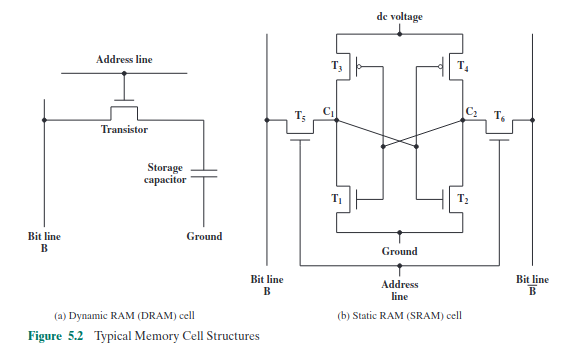
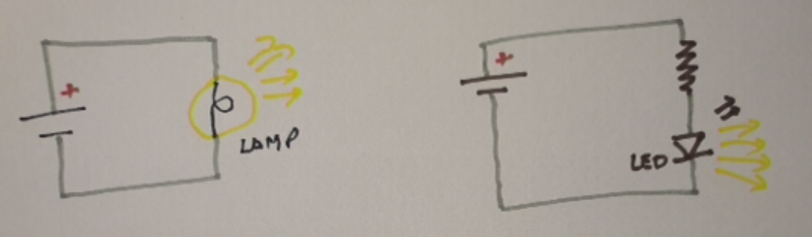
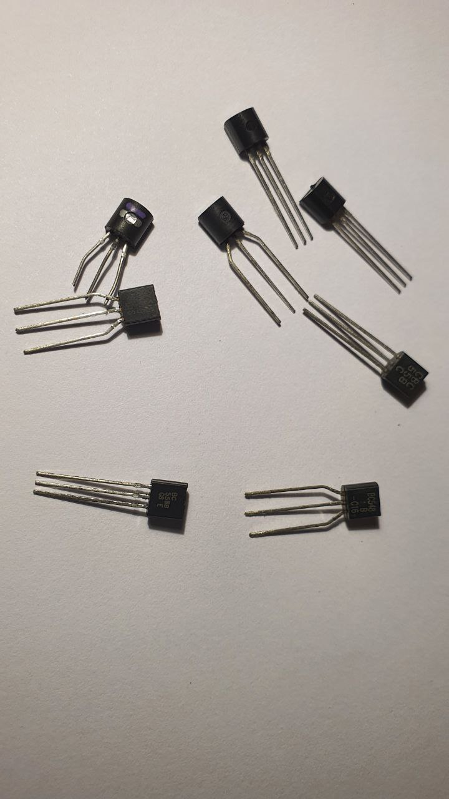
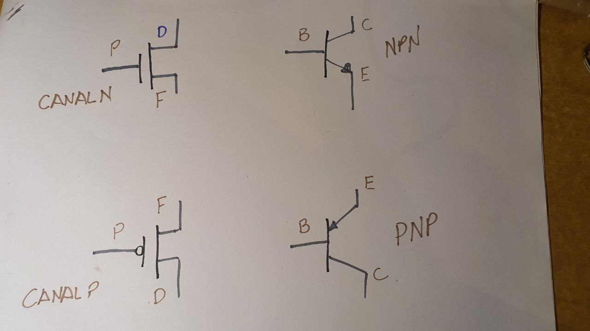
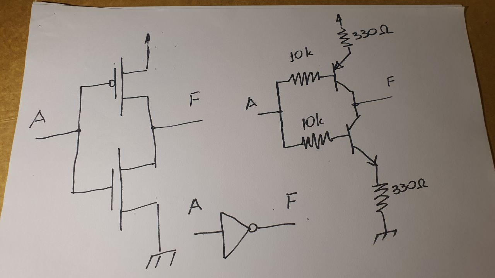
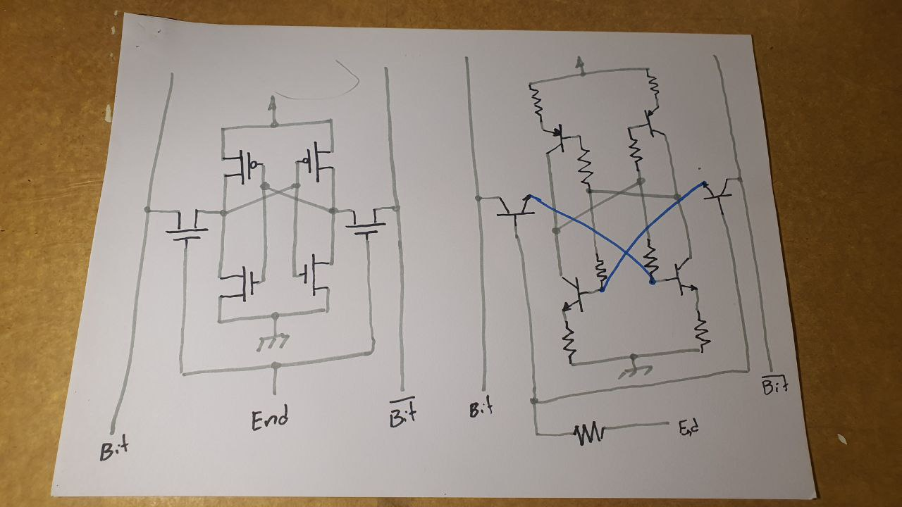
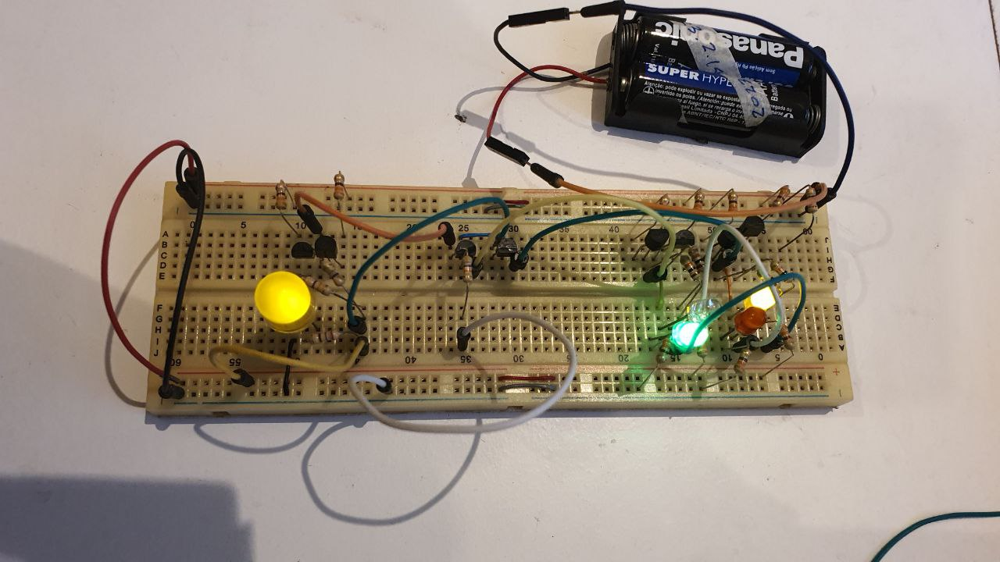

# O "problema"

Na leitura sequencial do livro, chega-se ao capítulo 5, onde apresenta-se uma célula de memória:
	

Fonte: STALLINGS, Computer Organization and Architectures, 10thEd.

Os circuitos são compostos por MOSFETs e, no caso do quadro (b), podem até ser agrupados em um flip-flop tipo RS e lógica de seleção, ou em dois inversores e lógica de seleção.

Flip-flops são apresentados na seção 11.4. Isto é feito a partir de portas lógicas, o que é tradicional, mas os circuitos das portas lógicas a partir de MOSFETs não é apresentado. O funcionamento e a estrutura física dos MOSFETs também não é apresentado, embora o MOSFET de porta flutuante seja mostrado (livro, figura 5.15), talvez por não ser um componente tradicional. Diagramas, como o do esquemático de partes da memória FLASH (livro, figura 5.16), mostram os MOSFETs de porta flutuante representados pelos símbolos dos MOSFETs tradicionais.

Acredito que isto justifique a elaboração de um texto que apresente algo sobre eletricidade, talvez, a partir do acender de uma lâmpada ou LED até a construção de uma porta lógica ou de uma célula de memória.

## Resistor

### Lei de Ohm

## Lâmpada comparada ao LED
 
Uma lâmpada de filamento (lâmpada de Edison) é, fisica e eletricamente, muito parecida com um resistor. É constituída por um filamento cujas extremidades são conectadas aos polos de uma fonte de energia. O aquecimento do filamento faz com que ele emita luz. Este mesmo aquecimento faz o material do filamento reagir com o ar (oxidação/combustão), o que modifica a composição do filamento, geralmente, fazendo que ele pare de emitir luz.

Um LED é um diodo. *Light Emitting Diode* = LED. Fisica e eletricamente bastante distinto de um resistor. Um diodo é composto por dois "blocos" de semicondutor com dopagens diferentes. A propriedade considerada mais importante num diodo é a passagem da corrente elétrica em uma só direção. A emissão de (e sensibilidade a) luz é uma propriedade "colateral", descoberta depois, e muito usada atualmente.

Conectados corretamente, é possível dizer que um LED é equivalente a uma lâmpada: ambas acendem quando passa por elas corrente suficiente na direção correta. 

## Chaves (interruptores)

São componentes que permitem interromper (ou não) a passagem de corrente. Interromper a passagem de corrente pode ser feito em qualquer parte do circuito. No caso do circuito a seguir, escolheu-se colocar um interruptor entre o polo negativo da bateria e o cátodo do LED.
 

### Os circuitos do vestibular (ou seria do ENEM?)

Geralmente não se explica além dos interruptores mecânicos o que induz associar que "é necessária uma pessoa para acionar o interruptor".

### Indo um pouco além do vestibular

Interruptores de acionamento elétrico, como relés (https://en.wikipedia.org/wiki/Relay), existem há mais de dois séculos. O relé é um componente eletromecânico.

Válvulas termiônicas (https://en.wikipedia.org/wiki/Vacuum_tube), um *spinoff* das lâmpadas, também podem ser usadas como interruptores de acionamento elétrico. Válvulas usam vácuo ou gases ionizáveis em seu interior.

Transistores (https://pt.wikipedia.org/wiki/Trans%C3%ADstor) também podem ser usados como interruptores de acionamento elétrico. Todos os transistores têm três terminais. A função de cada um varia de acordo com o tipo.

Existem muitos tipos de transistores que diferem nos encapsulamentos e nos princípios de operação. Indo direto ao ponto, os transistores usados em processadores, memórias, ... são MOSFETs, de Metal-Oxide Silicon Field Effect Transistor. Suas características físicas e elétricas e a melhor adequação dos processos de fabricação são as vantagens que provocaram a escolha dessa tecnologia.

MOSFETs "individualmente encapsulados" são componentes proporcionalmente caros e menos comuns que transistores bipolares (BJT). 

Há MOSFET de canal P e de canal N. Os terminais de um MOSFET são *Fonte (Source)*, *Dreno (Drain)* e *Porta (Gate)*. 

Há BJT PNP e NPN. Os terminais de um BJT são *Emissor*, *Coletor* e *Base*.
BC548 e BC558 são BJTs. O primeiro é NPN e o segundo é PNP.

Os símbolos dos MOSFET e dos BJT.

Nos usos a seguir um MOSFET de canal P equivale a um BJT PNP e um MOSFET de canal N equivale a um BJT NPN.

É possível apresentar essa equivalência usando simuladores de circuito.

https://www.tinkercad.com/things/6VaiTyRdRat-glorious-bruticus-luulia/editel?tenant=circuits

**nota**: Em livros em que o tema principal não são os circuitos, seus diagramas podem estar simplificados, por exemplo, omitindo componentes como resistores. Às vezes a ausência do resistor resulta em um curto-circuito. Neste caso, em um modelo abstrato, como um simulador, nada ocorre, a idéia até é transmitida corretamente. Na prática, em determinadas condições, o circuito queima.

#### BJT como chave

Manuais dos BJT que usei (links externos):
	- [BC548](https://www.mouser.com/datasheet/2/149/BC547-190204.pdf)
	- [BC558](https://www.onsemi.com/pdf/datasheet/bc556b-d.pdf)
	- [BC639](https://www.onsemi.com/pdf/datasheet/bc637-d.pdf)
	- [BC640](https://www.onsemi.com/pdf/datasheet/bc640-d.pdf)

*Apresentar modificação do circuito para acendimento de lâmpada e de LED incluindo transistor como chave - tanto NPN quanto PNP - e explicar funcionamento do circuito*.

Num transistor de junção, quando a corrente de coletor (Ic) é "significativa", a tensão entre base e emissor é da ordem de 0,7V para transistor NPN e -0,7V para transistor PNP (em ambos o diodo base-emissor precisa estar diretamente polarizado para a corrente de coletor passar). Numa simplificação prática, se |Vbe|<0,7 então Ic=0. Se |Vbe|>=0,7 então Ic=Beta*Ib. Esta última relação pode ser importante para calcular os valores dos resistores.

Para o cálculo do valor do resistor de base é necessário considerar que, em geral, um diodo não pode ser ligado diretamente à bateria e estar diretamente polarizado pois a corrente que passa por ele é muito alta. Por consequência, o diodo esquenta e acaba queimando. É idêntico a ligar um LED direto nos 5V da porta USB. 

*Explicar como um transistor pode ser queimado nas situações em que será colocado neste experimento e, consequentemente, justificar a presença de resistores limitadores de corrente*.

#### MOSFET como chave

2023-03-28-121505 .... uma historinha antes...

Tenho quase nenhuma experiência prática com FETs e MOSFETs.

Comecei tentando entender os símbolos do livro - um certo sucesso nisso: diferenciar MOSFET de canal P de MOSFET de canal N.

Para aumentar o detalhamento, procurei especificações de alguns modelos de MOSFET. Vi valores máximos suportados pelos componentes e curvas de funcionamento. Embora toda a informação que eu desejava estivesse ali, estava em uma linguagem pouco conveniente na ocasião. Então fui atrás de modelos matemáticos do MOSFET. Encontrei estas apresentações: https://www.ece.mcmaster.ca/~mbakr/ece2ei4/Lecture16_Web.pdf , https://inst.eecs.berkeley.edu/~ee105/fa05/handouts/discussions/Discussion5.pdf. As equações eram mais complicadas do que eu desejava, a referência de berkeley mostrava duas regiões de operação (não-saturado, saturado) e três modos de operação (cut-off, linear e saturação) e, na referência de mcmaster mencionava-se MOSFET de modo enriquecimento (enhancement) e de modo depleção (depletion); estes modos não têm nada a ver com os modos de operação. Então fui atrás de desatar esse nó e, talvez, encontrar um modelo mais simples.

Nesse contexto (partindo de quase zero, procurando como um componente funciona, sem grande detalhamento), com alguma precaução, Wikipedia é muito útil. Neste link: https://en.wikipedia.org/wiki/Depletion_and_enhancement_modes , explica-se que "modo" enriquecimento e "modo" depleção referem-se a dois tipos de componente (em contraposição a, por exemplo, um componente que funciona de dois modos diferentes). No modo enriquecimento, quando Vgs=0V não há canal, consequentemente Id=0mA, à medida que Vgs aumenta (à semelhança de Vbe), o canal se forma e Id vai aumentando. No modo depleção, quando Vgs=0 há canal (a construção é diferente), logo, Id>0. Vgs precisa ser menor que zero para ir "fechando" o canal (Id vai diminuindo) e, quando suficientemente negativo, Id=0.

Embora tenha "ganho" um modelo qualitativo, criei uma nova questão: "em circuitos digitais, qual componente é usado?"
	
A resposta que aceitei está em um artigo publicado pela ACM: https://dl.acm.org/doi/fullHtml/10.1145/3453143 . Neste está escrito "Enhancement mode is desirable for digital circuit and processor implementation, ...". Portanto, vou aceitar que os transistores que me interessam são os de modo enriquecimento. Acho que o artigo contém um modelo que eu possa usar.

Claro que, nessa exploração, passei por muitas outras referências:

- https://alan.ece.gatech.edu/ECE3040/Lectures/Lecture25-MOSTransQuantitativeId-Vd-Vg.pdf (modelo matemático extenso e alguns diagramas)
- https://home.kku.ac.th/rujchai/analog/FET.pdf (Comparação com BJT, diagramas muito bonitos, slide 16 tem uma analogia entre Ic=betaIb e Id=Idss(1-Vgs/Vp)^2 - acho que é esta a equação que preciso)
- https://electronics.stackexchange.com/questions/222863/relationship-between-vds-and-vgs-mosfet
- https://techweb.rohm.com/product/power-device/si/si-basic/5277/
- https://en.wikipedia.org/wiki/MOSFET_applications (em que MOSFETs são usados)
- https://en.wikipedia.org/wiki/Depletion-load_NMOS_logic (resistores em circuitos integrados NMOS)
- https://www.quora.com/Why-is-enhancement-MOSFET-preferred-over-depletion-MOSFET-for-switching-purposes
- https://www.electronics-tutorials.ws/transistor/tran_7.html MOSFET como chave	
- https://www.youtube.com/watch?v=8LXPcJD6hEA&t=1001s como funciona um Electronic Speed Controller (para motores DC sem escovas, como os de drones)
- https://en.wikipedia.org/wiki/Brushless_DC_electric_motor sobre motor sem escovas

 
## Inversor (porta lógica)

*Apresentar combinação dos circuitos de transistor como chave - NPN e PNP - que resulta do inversor e explicar funcionamento do circuito*.

## Célula de memória

Inspiração para circuito de endereçamento: https://www.researchgate.net/figure/Circuit-diagram-of-an-optimized-4H-SiC-4T-SRAM-cell-The-optimized-cell-operates-on-a_fig1_314296600

O circuito com BJT tem uma não conformidade pois as linhas de bit são somente para escrita na célula de memória. A linha de bit da célula de memória costuma ser bidirecional, algo que fica claro no diagrama do livro.

## Implementação da célula de memória com BJT

