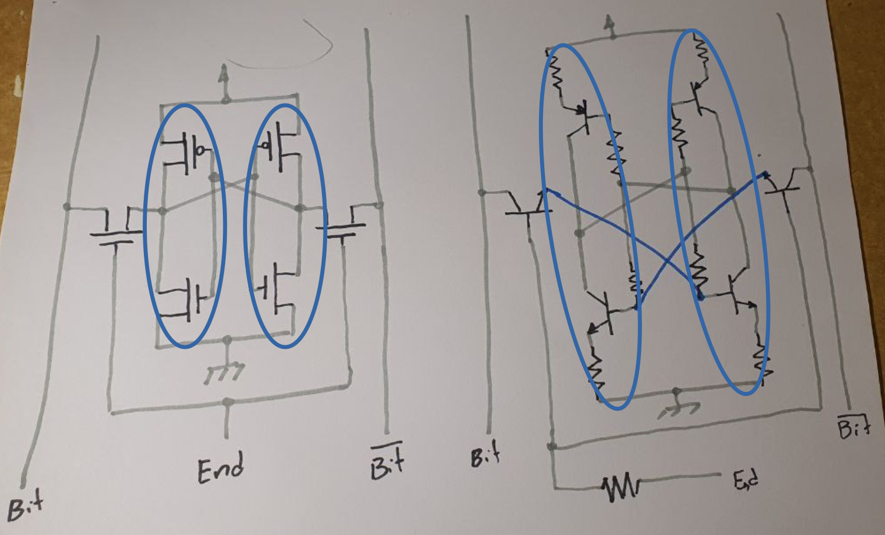

# O "problema"

Na leitura sequencial do livro, chega-se ao capítulo 5, onde apresenta-se uma célula de memória:
	

Fonte: STALLINGS, Computer Organization and Architectures, 10thEd.

Os circuitos são compostos por MOSFETs e, no caso do quadro (b), podem até ser agrupados em um flip-flop tipo RS e lógica de seleção, ou em dois inversores e lógica de seleção.

Flip-flops são apresentados na seção 11.4. Isto é feito a partir de portas lógicas, o que é tradicional, mas os circuitos das portas lógicas a partir de MOSFETs não é apresentado. O funcionamento e a estrutura física dos MOSFETs também não são apresentados, embora o MOSFET de porta flutuante seja mostrado (livro, figura 5.15), talvez por não ser um componente tradicional. Diagramas, como o do esquemático de partes da memória FLASH (livro, figura 5.16), mostram os MOSFETs de porta flutuante representados pelos símbolos dos MOSFETs tradicionais.

Acredito que isto justifique a elaboração de um texto que apresente algo sobre eletricidade, talvez, a partir do acender de uma lâmpada ou LED até a construção de uma porta lógica ou de uma célula de memória.

## Resistor

### Lei de Ohm

## Lâmpada comparada ao LED
 
Uma lâmpada de filamento (lâmpada de Edison) é, fisica e eletricamente, muito parecida com um resistor. É constituída por um filamento cujas extremidades são conectadas aos polos de uma fonte de energia, isto faz o filamento aquecer. O aquecimento do filamento faz com que ele emita luz. Este mesmo aquecimento faz o material do filamento tanto derreter quanto reagir (oxidar/queimar) com o (pouco) ar dentro do bulbo. Em algum momento o filamento rompe e para de emitir luz.

Um LED é um diodo. *Light Emitting Diode* = LED. Fisica e eletricamente bastante distinto de um resistor. Um diodo é composto por dois "blocos" de semicondutor com dopagens diferentes. A propriedade considerada mais importante num diodo é a passagem da corrente elétrica em uma só direção. A emissão de (e sensibilidade a) luz é uma propriedade "colateral", descoberta depois, e muito usada atualmente.

Conectados corretamente, é possível dizer que um LED é equivalente a uma lâmpada: ambas acendem quando passa por elas corrente suficiente. 

## Chaves (interruptores)

São componentes que permitem interromper (ou não) a passagem de corrente. Interromper a passagem de corrente pode ser feito em qualquer parte do circuito. No circuito da foto abaixo, escolheu-se colocar um interruptor entre o polo negativo da bateria e o cátodo do LED.
 

### Os circuitos do vestibular (ou seria do ENEM?)

Geralmente não se explica além dos interruptores mecânicos o que induz associar que "é necessária uma pessoa para acionar o interruptor".

### Indo um pouco além do vestibular

Interruptores de acionamento elétrico, como relés (https://en.wikipedia.org/wiki/Relay), existem há mais de dois séculos. O relé é um componente eletromecânico.

Válvulas termiônicas (https://en.wikipedia.org/wiki/Vacuum_tube), um *spinoff* das lâmpadas, também podem ser usadas como interruptores de acionamento elétrico. Válvulas usam vácuo ou gases ionizáveis em seu interior.

Transistores (https://pt.wikipedia.org/wiki/Trans%C3%ADstor) também podem ser usados como interruptores de acionamento elétrico. Todos os transistores têm três terminais. A função de cada um varia de acordo com o tipo.

Existem muitos tipos de transistores que diferem nos encapsulamentos e nos princípios de operação. Indo direto ao ponto, os transistores usados em processadores, memórias, ... são MOSFETs, de Metal-Oxide Silicon Field Effect Transistor. Suas características físicas e elétricas e a melhor adequação dos processos de fabricação são as vantagens que provocaram a escolha dessa tecnologia.

MOSFETs "individualmente encapsulados" são componentes proporcionalmente caros e menos comuns que transistores bipolares (BJT). 

Há MOSFET de canal P e de canal N. Os terminais de um MOSFET são *Fonte (Source)*, *Dreno (Drain)* e *Porta (Gate)*. 

Há BJT PNP e NPN. Os terminais de um BJT são *Emissor*, *Coletor* e *Base*.

BC548 e BC558 são BJTs. O primeiro é NPN e o segundo é PNP.

Os símbolos dos MOSFET e dos BJT.

Nos usos a seguir um MOSFET de canal P equivale a um BJT PNP e um MOSFET de canal N equivale a um BJT NPN.

É possível apresentar essa equivalência usando simuladores de circuito.

https://www.tinkercad.com/things/6VaiTyRdRat-glorious-bruticus-luulia/editel?tenant=circuits

**nota**: Em livros em que o tema principal não são os circuitos, seus diagramas podem estar simplificados, por exemplo, omitindo componentes como resistores. Às vezes a ausência do resistor resulta em um curto-circuito. Neste caso, em um modelo abstrato, como um simulador, nada ocorre, a idéia até é transmitida corretamente. Na prática, em determinadas condições, o circuito queima.

A seguir explicarei o uso de um BJT tipo NPN como chave. Esta explicação está baseada em modelos que descrevem o funcionamento do BJT. Mesmo não tendo procurado, tenho razoável certeza que existe um modelo que pode ser considerado o mais completo, e que deve ser razoavelmente complicado (muitas funções (regras) de muitas variáveis). A fim de não lidar com esse modelo complicado, recorrerei a diferentes simplificações desse modelo. Alguma cautela é necessária pois cada simplificação pode explicar bem um processo e não explicar, ou, explicar mal, outro processo. 

Alguns parâmetros desses modelos estão nos manuais dos BJT que usei (links externos):
	- [BC548](https://www.mouser.com/datasheet/2/149/BC547-190204.pdf)
	- [BC558](https://www.onsemi.com/pdf/datasheet/bc556b-d.pdf)
	- [BC639](https://www.onsemi.com/pdf/datasheet/bc637-d.pdf)
	- [BC640](https://www.onsemi.com/pdf/datasheet/bc640-d.pdf)

#### BJT como chave

No circuito de acendimento do LED com interruptor, este pode ser substituído por um BJT do tipo NPN:

No contexto do uso de transistor como chave, usa-se *o transistor conduz* quando a corrente de coletor é a máxima possível. Destacando o que ocorre entre Coletor e Emissor, desprezando o que ocorre na Base, o transistor comporta-se como um resistor de **baixo** valor conectando Coletor e Emissor. Ainda no mesmo contexto, usa-se *o transistor não conduz* quando a corrente de coletor é a mínima possível. Destacando o que ocorre entre Coletor e Emissor, desprezando o que ocorre na Base, o transistor comporta-se como um resistor de **alto** valor conectando Coletor e Emissor. 

No circuito da imagem acima, se o ponto X for ligado ao positivo da bateria (usualmente correspondente ao nível lógico 1), o transistor conduz, consequentemente o LED acenderá., se o ponto X for deixado desconectado ou ligado ao negativo da bateria (usualmente corresponde ao nível lógico zero) o transistor não conduz, consequentemente o LED ficará apagado.

O resistor RB é necessário para limitar tensão e corrente na base do transistor. Tensão e corrente excessivas farão o trasistor queimar.

<!--- Num transistor de junção, quando a corrente de coletor (Ic) é "significativa", a tensão entre base e emissor é da ordem de 0,7V para transistor NPN e -0,7V para transistor PNP (em ambos o diodo base-emissor precisa estar diretamente polarizado para a corrente de coletor passar). Numa simplificação prática, se |Vbe|<0,7 então Ic=0. Se |Vbe|>=0,7 então Ic=Beta*Ib. Esta última relação pode ser importante para calcular os valores dos resistores.

Para o cálculo do valor do resistor de base é necessário considerar que, em geral, um diodo não pode ser ligado diretamente à bateria e estar diretamente polarizado pois a corrente que passa por ele é muito alta. Por consequência, o diodo esquenta e acaba queimando. É idêntico a ligar um LED direto nos 5V da porta USB. 

*Explicar como um transistor pode ser queimado nas situações em que será colocado neste experimento e, consequentemente, justificar a presença de resistores limitadores de corrente*.

--->

O circuito que chaveia do lado positivo da bateria, em geral, é implementado com um BJT do tipo PNP. O circuito resultante funciona, de certa forma, como um complementar do funcionamento do BJT NPN. ié: conectando o ponto Y ao negativo da bateria o transistor conduz, consequentemente o LED acende, deixando o ponto Y desconectado ou conectando-o ao positivo da bateria o transistor não conduz, consequentemente o LED não acende. 
	

Outra diferença importante entre transistor e interruptor é que transistor deixa passar corrente num sentido e interruptor deixa passar corrente nos dois sentidos.

#### MOSFET como chave (a fazer)

<!---

2023-03-28-121505 .... uma historinha antes...

Tenho quase nenhuma experiência prática com FETs e MOSFETs.

Comecei tentando entender os símbolos do livro - um certo sucesso nisso: diferenciar MOSFET de canal P de MOSFET de canal N.

Para aumentar o detalhamento, procurei especificações de alguns modelos de MOSFET. Vi valores máximos suportados pelos componentes e curvas de funcionamento. Embora toda a informação que eu desejava estivesse ali, estava em uma linguagem pouco conveniente na ocasião. Então fui atrás de modelos matemáticos do MOSFET. Encontrei estas apresentações: https://www.ece.mcmaster.ca/~mbakr/ece2ei4/Lecture16_Web.pdf , https://inst.eecs.berkeley.edu/~ee105/fa05/handouts/discussions/Discussion5.pdf. As equações eram mais complicadas do que eu desejava, a referência de berkeley mostrava duas regiões de operação (não-saturado, saturado) e três modos de operação (cut-off, linear e saturação) e, na referência de mcmaster mencionava-se MOSFET de modo enriquecimento (enhancement) e de modo depleção (depletion); estes modos não têm nada a ver com os modos de operação. Então fui atrás de desatar esse nó e, talvez, encontrar um modelo mais simples.

Nesse contexto (partindo de quase zero, procurando como um componente funciona, sem grande detalhamento), com alguma precaução, Wikipedia é muito útil. Neste link: https://en.wikipedia.org/wiki/Depletion_and_enhancement_modes , explica-se que "modo" enriquecimento e "modo" depleção referem-se a dois tipos de componente (em contraposição a, por exemplo, um componente que funciona de dois modos diferentes). No modo enriquecimento, quando Vgs=0V não há canal, consequentemente Id=0mA, à medida que Vgs aumenta (à semelhança de Vbe), o canal se forma e Id vai aumentando. No modo depleção, quando Vgs=0 há canal (a construção é diferente), logo, Id>0. Vgs precisa ser menor que zero para ir "fechando" o canal (Id vai diminuindo) e, quando suficientemente negativo, Id=0.

Embora tenha "ganho" um modelo qualitativo, criei uma nova questão: "em circuitos digitais, qual componente é usado?"
	
A resposta que aceitei está em um artigo publicado pela ACM: https://dl.acm.org/doi/fullHtml/10.1145/3453143 . Neste está escrito "Enhancement mode is desirable for digital circuit and processor implementation, ...". Portanto, vou aceitar que os transistores que me interessam são os de modo enriquecimento. Acho que o artigo contém um modelo que eu possa usar.

Claro que, nessa exploração, passei por muitas outras referências:

- https://alan.ece.gatech.edu/ECE3040/Lectures/Lecture25-MOSTransQuantitativeId-Vd-Vg.pdf (modelo matemático extenso e alguns diagramas)
- https://home.kku.ac.th/rujchai/analog/FET.pdf (Comparação com BJT, diagramas muito bonitos, slide 16 tem uma analogia entre Ic=betaIb e Id=Idss(1-Vgs/Vp)^2 - acho que é esta a equação que preciso)
- https://electronics.stackexchange.com/questions/222863/relationship-between-vds-and-vgs-mosfet
- https://techweb.rohm.com/product/power-device/si/si-basic/5277/
- https://en.wikipedia.org/wiki/MOSFET_applications (em que MOSFETs são usados)
- https://en.wikipedia.org/wiki/Depletion-load_NMOS_logic (resistores em circuitos integrados NMOS)
- https://www.quora.com/Why-is-enhancement-MOSFET-preferred-over-depletion-MOSFET-for-switching-purposes
- https://www.electronics-tutorials.ws/transistor/tran_7.html MOSFET como chave	
- https://www.youtube.com/watch?v=8LXPcJD6hEA&t=1001s como funciona um Electronic Speed Controller (para motores DC sem escovas, como os de drones)
- https://en.wikipedia.org/wiki/Brushless_DC_electric_motor sobre motor sem escovas

--->

 
## Inversor (porta lógica que implementa a função NOT)

Nota-se que no circuito com transistor NPN, pelo funcionamento do transistor, o Coletor ou está nível lógico zero ou está desconectado. No circuito com transistor PNP, o Coletor ou está em nível lógico um ou está desconectado. Num inversor (porta lógica NOT), em princípio, deseja-se que sua saída seja ou nível lógico um ou nível lógico zero. É possível conseguir esse funcionamento combinando os dois circuitos de chave (nota: é possível obter esse funcionamento de outras formas). Essa combinação de transistores complementares é mostrada na imagem abaixo, tanto com MOSFETs (esquerda) quanto com BJTs (direita).

Nos dois inversores, quando o ponto A é conectado ao positivo da bateria (nível lógico um), o ponto F vai a nível lógico zero, quando o ponto A é conectado ao negativo da bateria (nível lógico zero), o ponto F vai a nível lógico um. 

Acredito que isto ajude a esclarecer que as funções lógicas, tratadas em disciplinas como Matemática Discreta, podem ser implementadas em circuitos elétricos (eletrônicos). Isto permite projetar circuitos com o objetivo de implementar (executar) alguma (determinada) função lógica. 

**nota**: por completude, convém mostrar o circuito a transistores que implementa a porta NAND, como apresentado em https://en.wikipedia.org/wiki/NAND_gate#Implementations
 
**nota**: a partir de portas NAND é possível construir portas NOT, consequentemente portas AND e portas OR (pode ser demonstrado aplicando o teorema de DeMorgan, por exemplo), o que é mostrado no livro, capítulo 11 e no verbete da wikipedia https://en.wikipedia.org/wiki/NAND_gate#Functional_completeness

## Célula de memória

No livro a célula de memória é mostrada no capítulo 5 e é explicada em detalhes no capítulo 11. A explicação do capítulo 11 segue uma sequência que parece ser consenso nos livros: parte explicando o que é um flip-flop, apresenta o flip-flop RS (implementado com portas lógicas), e segue. Ocorre que ou eu não encontrei ou não há no livro a implementação do flip-flop RS com transistores, que é a usada no capítulo 5.

**nota**: Desperta curiosidade que em uma busca de dez minutos por *flip flop rs complementary bjt* com Google não traz esse tal circuito como resultado mais provável. Os resultados mais prováveis mostram flip flops rs implementados com BJTs mas não complementares. Por exemplo: https://en.wikipedia.org/wiki/Flip-flop_(electronics)

**nota**: A fim de manter a linearidade deste texto (lâmpada, chave, transistor como chave, inversor, ...) apresentarei a construção da célula de memória a partir de inversores. Esta não é a abordagem mais comum.

Uma célula de memória armazena(retém) um bit que pode ser modificado sempre que for desejado. Este funcionamento não pode ser obtido com circuitos combinacionais, embora memórias **somente para leitura** possam ser implementadas somente com circuitos combinacionais, **memórias para leitura e escrita não podem**. 

Existem vários circuitos que podem ser usados para armazenar um bit. O circuito tradicionalmente usado para explicar esse uso é o flip-flop RS: https://en.wikipedia.org/wiki/Flip-flop_%28electronics%29#SR_NOR_latch - sugere-se ler essa referência e retornar a este texto. Alguns conceitos e elaborações implícitas na referência serão explicadas a seguir.

### Historinha...

> The R = S = 1 combination is called a restricted combination or a forbidden state because, as both NOR gates then output zeros, it breaks the logical equation Q = not Q. The combination is also inappropriate in circuits where both inputs may go low simultaneously (i.e. a transition from restricted to keep). The output would lock at either 1 or 0 depending on the propagation time relations between the gates (a race condition). 

Um estudante procurou-me para explicar por que R=S=1 é uma combinação proibida em um FF RS feito com portas NOR. Meu primeiro impulso foi dizer que essa combinação faz o FF oscilar. MAS, aplicando R=S=1 o circuito não oscila (pode testar, seja no papel, seja montando o circuito) e Q=~Q=0, estável. O problema acontece no retorno a R=S=0 (condição de repouso): **a condição Q=~Q=0 e R=S=1 é estável mas a condição Q=~Q=0 e R=S=0 é instável**. Consequentemente, se o circuito for colocado em Q=~Q=0 e R=S=1 e, em seguida, faz-se R=S=0, os sinais mudam rapidamente para uma condição estável. MAS há duas condições estáveis possíveis: (a) Q=0, ~Q=1 e R=S=0 e (b) Q=1, ~Q=0 e R=S=0. Em qual condição (a) ou (b) o circuito chega depende de detalhes não controlados da construção dos componentes e do circuito, ou seja, não se sabe ao certo em que condição o circuito chega.

Não saber em que condição o FF, em operação normal, está, "quebra" a sequência de funcionamentos sobre a qual baseia-se a construção dos computadores atuais. Acho que é motivo suficiente para evitar operar nessa condição :)

### ... voltando ...

A partir do momento em que dispõe-se de circuitos que armazenam bits, a tabela verdade que descreve seu funcionamento deve considerar como variável de entrada o bit que está armazenado e, como variável de saída, o novo bit armazenado. Num FF RS poderia resultar em:

| R | S | bit armazenado ($Q$) | novo bit ($Q$) |
| --- | --- | --- | --- |
| 0 | 0 | 0 | 0 |
| 0 | 1 | 0 | 1 |
| 1 | 0 | 0 | 0 |
| 1 | 1 | Proibido | Proibido |
| 0 | 0 | 1 | 1 |
| 0 | 1 | 1 | 1 |
| 1 | 0 | 1 | 0 |
| 1 | 1 | Proibido | Proibido |

Acontece que essa tabela não representa bem o funcionamento do circuito - é difícil interpretar e chegar à conclusão que é um FF RS; e contém ambiguidades na notação - tanto o bit armazenado quanto o novo bit são Q, em instantes diferentes, mas a notação não permite codificar diferentes instantes.

Ajusta-se isso empregando tabelas de transição de estados (https://en.wikipedia.org/wiki/State-transition_table). Nestas o bit armazenado é representado por uma letra (no caso acima, $Q$) e, quando ocorre a transição, o novo bit é representado pela mesma letra e subscrito next (como $Q_{next}$)

| R | S | $Q$ | $Q_{next}$) |
| --- | --- | --- | --- |
| 0 | 0 | 0 | 0 |
| 0 | 1 | 0 | 1 |
| 1 | 0 | 0 | 0 |
| 1 | 1 | Proibido | Proibido |
| 0 | 0 | 1 | 1 |
| 0 | 1 | 1 | 1 |
| 1 | 0 | 1 | 0 |
| 1 | 1 | Proibido | Proibido |

Ainda não é igual à tabela apresentada em https://en.wikipedia.org/wiki/Flip-flop_(electronics)#SR_NOR_latch . É possível construir um algoritmo que leva da tabela acima para a tabela apresentada. À semelhança de simplificação de expressões booleanas, linhas iguais da tabela podem ser agrupadas:
	
| R | S | $Q$ | $Q_{next}$) |
| --- | --- | --- | --- |
| 0 | 0 | 0 | 0 |
| 0 | 1 | 0 | 1 |
| 1 | 0 | 0 | 0 |
| 0 | 0 | 1 | 1 |
| 0 | 1 | 1 | 1 |
| 1 | 0 | 1 | 0 |
| 1 | 1 | Proibido | Proibido |

Como R=S=0 é, por construção do circuito, o estado de repouso, então $Q_{next}=Q$

| R | S | $Q$ | $Q_{next}$) |
| --- | --- | --- | --- |
| 0 | 0 | 0 | $Q$ |
| 0 | 1 | 0 | 1 |
| 1 | 0 | 0 | 0 |
| 0 | 0 | 1 | $Q$ |
| 0 | 1 | 1 | 1 |
| 1 | 0 | 1 | 0 |
| 1 | 1 | Proibido | Proibido |

Como no estado de repouso, $Q_{next}=Q$, independende do valor de $Q$, então as linhas podem ser agrupadas (este tipo de agrupamento só pode ser feito com variáveis de entrada):
	
| R | S | $Q$ | $Q_{next}$) |
| --- | --- | --- | --- |
| 0 | 0 | X | $Q$ |
| 0 | 1 | 0 | 1 |
| 1 | 0 | 0 | 0 |
| 0 | 1 | 1 | 1 |
| 1 | 0 | 1 | 0 |
| 1 | 1 | Proibido | Proibido |

Como, por construção do circuito, se S for colocado em 1 então Q vai para 1 independente de R e de Q, as linhas podem ser agrupadas:
	
| R | S | $Q$ | $Q_{next}$) |
| --- | --- | --- | --- |
| 0 | 0 | X | $Q$ |
| X | 1 | X | 1 |
| 1 | 0 | 0 | 0 |
| 1 | 0 | 1 | 0 |
| 1 | 1 | Proibido | Proibido |

Como, por construção do circuito, se R for colocado em 1 então Q vai para 0 independente de S e de Q, as linhas podem ser agrupadas:
	
| R | S | $Q$ | $Q_{next}$) |
| --- | --- | --- | --- |
| 0 | 0 | X | $Q$ |
| X | 1 | X | 1 |
| 1 | X | X | 0 |
| 1 | 1 | Proibido | Proibido |

Resta que a coluna $Q$ não agrega informação, logo, pode ser omitida.

| R | S | $Q_{next}$) |
| --- | --- | --- |
| 0 | 0 | $Q$ |
| X | 1 | 1 |
| 1 | X | 0 |
| 1 | 1 | Proibido |

A tabela acima é a tabela de transição de estados (tabela característica) de um FF RS.

Explicado o FF RS clássico, cabe colocar que há outras implementações do FF RS, por exemplo, usando inversores (portas NOT):
	

Fonte: https://ja.wikipedia.org/wiki/%E3%83%95%E3%82%A1%E3%82%A4%E3%83%AB:SR_Latch_(Inverter).svg, referência na Wikipedia: https://ja.wikipedia.org/wiki/%E3%83%A9%E3%83%83%E3%83%81%E5%9B%9E%E8%B7%AF

A tabela de transição de estados é a mesma do FF RS clássico. A vantagem deste circuito é que substituindo os inversores pelos circuitos equivalentes com MOSFETs ou com BJTs resulta em:

... que já é bastante próximo da célula de memória do capítulo 5 do livro.

... os dois transistores acrescentados fazem parte do circuito lógico de seleção da célula de memória. Seleciona-se a célula colocando o  ponto End em nível lógico 1. Abaixo as células de memória com cada inversor dentro de uma elipse azul. Os transistores que não estão nas elipses implementam a parte do circuito de seleção que fica dentro da célula de memória.

Numa operação de leitura, colocar End em 1 e ler Bit ou Bit' recupera o conteúdo armazenado.

Numa operação de escrita, colocando um nível lógico em Bit e Bit' e selecionando a célula (End=1) grava o novo bit na célula. 

<!---

As operações que a célula suporta são leitura e escrita. Frequentemente células de memória são organizadas em longos vetores (arrays) e suas entradas/saídas de dados são conectadas juntas em um barramento. Nesta maneira de organizar, torna-se necessário algum circuito lógico para selecionar a célula lida/escrita. Isto é feito com decodificadores e uma ou duas portas AND. Nos texto que li há mais ênfase no processo de retenção do bit que no processo de seleção da célula e no acesso ao bit armazenado(retido).

A célula de memória, fixado um instante no tempo, contém unicamente um bit.

| Seleção | Dado | bit armazenado | novo bit |
| --- | --- | --- | --- |
| 0 | 0 | 0 | 0 |
| 0 | 1 | 0 | 0 |
| 1 | 0 | 0 | 0 |
| 1 | 1 | 0 | 1 |
| 0 | 0 | 1 | 1 |
| 0 | 1 | 1 | 1 |
| 1 | 0 | 1 | 0 |
| 1 | 1 | 1 | 1 |

--->

## Implementação da célula de memória com BJT

Acredito que isto ajude a esclarecer o funcionamento de uma célula de memória. 

### Notas

Inspiração para circuito de endereçamento: https://www.researchgate.net/figure/Circuit-diagram-of-an-optimized-4H-SiC-4T-SRAM-cell-The-optimized-cell-operates-on-a_fig1_314296600

O circuito com BJT tem uma não conformidade pois as linhas de bit são somente para escrita na célula de memória. A linha de bit da célula de memória costuma ser bidirecional, algo que fica claro no diagrama do livro.

